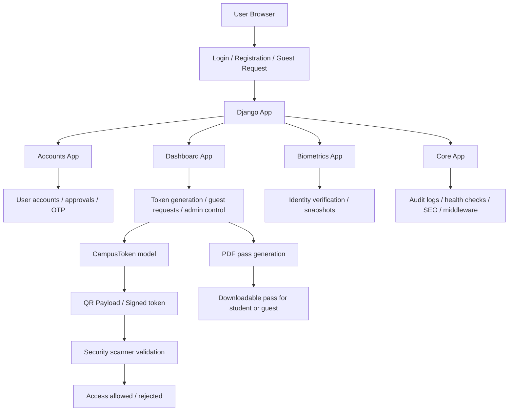

# Smart Campus

Smart Campus is a Django-based campus access and token management system built for students, security staff, branch administrators, and the main admin. It supports secure login, admin approval flows, biometrics-based identity verification, QR token validation, guest access requests, and campus token PDF generation.

## Project overview

This project manages how people gain campus access:

- Students apply for approval, verify identity, and generate signed QR-based campus tokens.
- Security staff validate scanned tokens at access points.
- Admins review student and staff approval requests.
- Visitors, parents, and guests can submit temporary access requests.
- Guest requests can be approved, rejected, or canceled, and their token records remain auditable.

---

## Key features

- Role-based access control for students, admin, and security staff
- Email verification and approval flow for accounts
- Identity verification using captured biometric snapshots
- QR-coded campus token generation and validation
- Token expiry, cancellation, and audit tracking
- Guest/visitor temporary access requests with approval queue
- PDF pass generation for issued tokens
- Campus map and location data management
- Security headers, rate limiting, CSRF protection, and CSP configuration
- Local browser token persistence for guest and student token dashboards

---

## Tech stack

- Python 3.x
- Django 5.x
- PostgreSQL support (with SQLite fallback for local development)
- DRF (Django REST Framework)
- django-allauth
- django-ratelimit
- django-csp
- django-cors-headers
- WhiteNoise
- Pillow
- qrcode
- reportlab
- Cloudinary storage support

---

## System architecture



---

## High-level project structure

```text
Your-Campus-Token/
├── accounts/
│   ├── admin.py
│   ├── adapters.py
│   ├── forms.py
│   ├── managers.py
│   ├── models.py
│   ├── tests.py
│   ├── urls.py
│   └── views.py
├── api/
│   ├── __init__.py
│   └── index.py
├── biometrics/
│   ├── admin.py
│   ├── apps.py
│   ├── models.py
│   ├── snapshots.py
│   ├── tests.py
│   ├── urls.py
│   └── views.py
├── config/
│   ├── asgi.py
│   ├── settings.py
│   ├── settings_local.py
│   ├── urls.py
│   └── wsgi.py
├── core/
│   ├── admin.py
│   ├── context_processors.py
│   ├── middleware.py
│   ├── models.py
│   ├── reports.py
│   ├── seo.py
│   ├── static_storage.py
│   ├── tests.py
│   ├── urls.py
│   └── views.py
├── dashboard/
│   ├── admin.py
│   ├── location_urls.py
│   ├── models.py
│   ├── notifications.py
│   ├── tests.py
│   ├── token_utils.py
│   ├── urls.py
│   └── views.py
├── static/
│   ├── css/
│   └── js/
├── templates/
│   ├── accounts/
│   ├── dashboard/
│   ├── base.html
│   ├── csrf_failure.html
│   └── socialaccount/
├── .env.example (if used in deployment)
├── build_files.sh
├── manage.py
├── netlify.toml
├── presentation.md
├── requirements.txt
├── vercel.json
└── README.md
```

---

## Application modules and responsibilities

### 1. accounts

This app handles user identity and access management.

Files:
- accounts/models.py
  - Defines the custom user model and role-based permission logic.
  - Includes `User` with roles: `ADMIN`, `STUDENT`, and `SECURITY`.
  - Contains approval and security PIN logic.
- accounts/views.py
  - Handles login, registration, OTP verification, and guest access request submission.
- accounts/forms.py
  - Contains forms for registration, sign-in, OTP, and guest request intake.
- accounts/managers.py
  - Custom user manager for creating approved and verified users.
- accounts/adapters.py
  - Allauth adapter customization for social login and campus-specific behavior.

This module is the foundation for authentication and user approval workflows.

### 2. dashboard

This is the main business app for campus access control and token operations.

Files:
- dashboard/models.py
  - `CampusToken` model stores issued access tokens.
  - `GuestTokenRequest` tracks guest/visitor requests and approval status.
  - `TokenAudit` stores validation snapshots for auditing.
  - `CampusLocation` stores map/entry locations.
- dashboard/views.py
  - Contains dashboards for students, security, and admins.
  - Handles issuing tokens, canceling tokens, approving guest requests, and validation endpoints.
- dashboard/urls.py
  - Routes for dashboard pages and API endpoints.
- dashboard/token_utils.py
  - Contains QR payload, signed token logic, and PDF generation helpers.
- dashboard/notifications.py
  - Sends email notifications for account approval and token creation.
- dashboard/location_urls.py
  - API routes for campus locations.

This is the primary logic center for the Smart Campus access system.

### 3. biometrics

This module is responsible for identity verification using snapshots and verification metadata.

Files:
- biometrics/models.py
  - `IdentityVerification` model stores the captured verification snapshot and expiry.
- biometrics/views.py
  - Handles image verification workflow and access validation.
- biometrics/snapshots.py
  - Processes webcam or uploaded image data into verification artifacts.

This module protects access generation by ensuring a valid identity verification exists before issuing a token.

### 4. core

The core app provides shared infrastructure and platform-level behavior.

Files:
- core/middleware.py
  - Security and audit middleware.
- core/context_processors.py
  - SEO and site metadata context.
- core/seo.py
  - Sitemap and robots metadata.
- core/views.py
  - Health checks and static asset endpoints.
- core/static_storage.py
  - Custom static file storage behavior.

This app handles cross-cutting concerns such as security headers, audits, health monitoring, and general app infrastructure.

### 5. config

This module defines Django project settings and URL wiring.

Files:
- config/settings.py
  - Main Django config and environment setup.
  - Includes authentication, middleware, database, security, email, and static file configuration.
- config/urls.py
  - Root URL configuration for admin, accounts, dashboard, and API routes.
- config/asgi.py
- config/wsgi.py

This is the project entry point and deployment configuration area.

---

## Data model summary

### User model
The `accounts.User` model includes:

- email
- full name
- role
- branch
- approval flags
- email verification flag
- profile photo
- security PIN hash

The `can_login` property enforces whether a user is allowed to access the system.

### CampusToken model
This model stores issued access tokens with:

- user or guest_request relation
- generated public UUID
- hashed token value
- expiry and revocation timestamps
- used timestamp and user who validated it

### GuestTokenRequest model
This model stores temporary visitor information:

- name
- gender
- email
- mobile
- purpose
- live photo
- duration
- status
- approver and approval timestamp

Statuses include pending, main admin required, approved, rejected, and cancelled.

### IdentityVerification model
This records the identity verification result for a user, including the captured snapshot and expiry time.

---

## Token issuance and validation flow

1. A student or guest is approved or enters the system.
2. A campus token is generated using the dashboard token workflow.
3. A QR payload is signed and shared to the token holder.
4. Security staff validate the QR payload at a gate or access point.
5. The backend checks:
   - token validity
   - expiry
   - revocation
   - approval state
   - single-use constraints
6. If valid, the token is marked as used and access is granted.

---

## Security and compliance features

- CSRF protection via custom cookie naming
- secure session settings in production
- HTTPS enforcement in deployment
- Content Security Policy configuration
- rate limiting for login and request endpoints
- user approval process before access is granted
- token auditing for traceability
- audit logging middleware for key actions

---

## Frontend and templates

The project has a mixed Django template + static JS approach.

### Main template folders
- templates/accounts/
  - login, registration, guest request pages
- templates/dashboard/
  - student, admin, security, guest, token management pages
- templates/base.html
  - site-wide layout and shared UI

### Static assets
- static/css/
  - application styling
- static/js/
  - dashboard logic, token generation, QR handling, camera capture, theme toggling, and security scanner code

---

## Environment and deployment notes

This project supports:

- local SQLite development
- PostgreSQL deployment via `DATABASE_URL`
- Cloudinary-backed media storage when configured
- Vercel or Netlify deployment support through project config files

Important environment variables include:

- `DJANGO_SECRET_KEY`
- `JWT_SECRET`
- `DJANGO_ALLOWED_HOSTS`
- `DATABASE_URL`
- `CLOUDINARY_URL`
- `EMAIL_HOST` and related mail settings
- `CORS_ALLOWED_ORIGINS`
- `GOOGLE_CLIENT_ID` and `GOOGLE_CLIENT_SECRET`

---

## Local setup

1. Clone the repository.
2. Create a virtual environment.
3. Install dependencies:

```bash
pip install -r requirements.txt
```

4. Apply migrations:

```bash
python manage.py migrate
```

5. Create a superuser:

```bash
python manage.py createsuperuser
```

6. Run the application:

```bash
python manage.py runserver
```

7. Visit:

- http://localhost:8000/
- http://localhost:8000/accounts/login/
- http://localhost:8000/dashboard/

---

## Example workflow

### Student flow
1. User registers and verifies email.
2. Admin approves the student account.
3. Student verifies identity.
4. Student generates a campus token.
5. Token is shown as a QR pass and can be downloaded as a PDF.
6. Security scans and validates the token.

### Guest flow
1. Guest submits a temporary request with personal and purpose details.
2. Security or admin reviews the request.
3. Approved guest gets access token with QR code and expiry.
4. Token can be canceled if needed.

---

## Main entry files

- manage.py — Django project entry point
- config/settings.py — global configuration
- config/urls.py — project router
- dashboard/views.py — main business logic
- dashboard/models.py — core data models
- accounts/models.py — custom user model
- biometrics/snapshots.py — face and verification image handling
- static/js/dashboard.js — frontend token generation and countdown logic
- templates/dashboard/student.html — student access dashboard
- templates/dashboard/guest_request_detail.html — guest request and token detail UI
- templates/dashboard/guest_requests.html — guest request queue

---

## Summary

Smart Campus is a full-stack campus access solution that combines secure authentication, identity verification, token-based access validation, guest management, and administrative controls. It is designed for institutions where access must be verified, auditable, and role-aware.

---

## License

This project is intended for academic or institutional deployment and is distributed as a local project repository. Update this section with your project's actual license if needed.