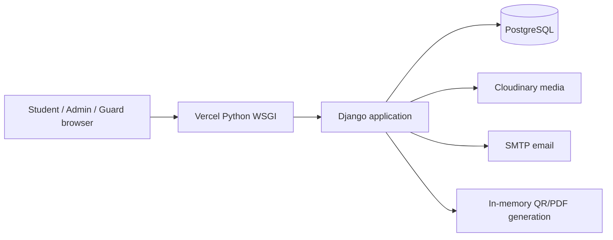
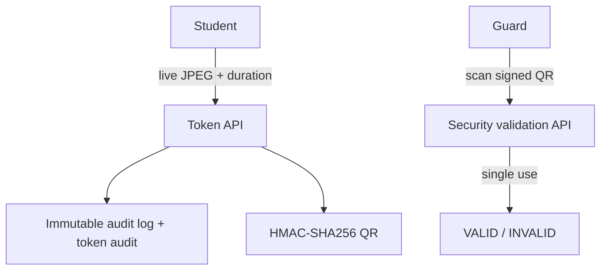

# Smart Campus Token Management System

Django application for student campus tokens, webcam audit snapshots, signed QR passes, security-gate validation, campus navigation, notifications, and administrator reporting.

## Architecture





## Security Features

- Production secrets are read only from environment variables. Never commit `.env`.
- Production requires `DJANGO_SECRET_KEY`, `JWT_SECRET`, `DATABASE_URL`, `CLOUDINARY_URL`, and explicit `DJANGO_ALLOWED_HOSTS`.
- PostgreSQL is selected through `DATABASE_URL`; local development defaults to SQLite.
- WhiteNoise serves compressed, manifest-hashed static files.
- Cloudinary is selected for media storage when `CLOUDINARY_URL` is configured.
- CSRF, secure cookies, HTTPS redirect, HSTS, referrer policy, CSP, and CORS restrictions are configured for production.
- Audit middleware records authentication, token operations, administrator decisions, and face/identity verification requests with status, user, IP, user agent, path, and timestamp.
- Audit records are immutable at the model layer.
- Token QR payloads are signed with HMAC-SHA256 and validated before gate use.
- Tokens are time-bound and single-use at the security gate.
- Token and PDF lookups are owner-scoped or role-scoped.
- Campus location writes are administrator-only and validate coordinate ranges.

## Local Setup

```bash
python3 -m venv .venv
source .venv/bin/activate
pip install -r requirements.txt
cp .env.example .env
python manage.py migrate
python manage.py collectstatic --noinput
python manage.py createsuperuser
python manage.py runserver
```

For local development, leave `DJANGO_DEBUG=True` and omit `DATABASE_URL` and `CLOUDINARY_URL`. The app then uses SQLite and local static/media behavior.

## Environment Variables

| Variable | Purpose |
|---|---|
| `DJANGO_SECRET_KEY` | Django secret and QR signing key input |
| `JWT_SECRET` | Separate production signing secret for future JWT integrations |
| `DJANGO_DEBUG` | `False` in production |
| `DJANGO_ALLOWED_HOSTS` | Comma-separated production hosts |
| `DJANGO_SITE_URL` | Canonical public URL |
| `DJANGO_CSRF_TRUSTED_ORIGINS` | Trusted HTTPS origins |
| `DATABASE_URL` | PostgreSQL connection URL |
| `CLOUDINARY_URL` | Cloudinary media credentials |
| `MEDIA_URL` | Public Cloudinary media URL |
| `CORS_ALLOWED_ORIGINS` | Comma-separated trusted browser origins |
| `EMAIL_HOST`, `EMAIL_PORT` | SMTP server |
| `EMAIL_HOST_USER`, `EMAIL_HOST_PASSWORD` | SMTP credentials |
| `EMAIL_USE_TLS` | Enable SMTP TLS |
| `DEFAULT_FROM_EMAIL` | Notification sender |
| `GOOGLE_CLIENT_ID`, `GOOGLE_CLIENT_SECRET` | Google OAuth credentials |

Do not put real credentials in source code, static JavaScript, templates, or committed files.

## Audit Reports

Administrators can download:

- `/admin-tools/reports/audit.csv`
- `/admin-tools/reports/audit.xlsx`

Both endpoints require an authenticated administrator. The XLSX report is created in memory with `openpyxl`; no report file is written to server disk.

## Vercel Deployment Without Docker

This project deliberately contains no Dockerfile or Docker build configuration.

1. Push the repository to GitHub.
2. Import the repository into Vercel.
3. Configure the project environment variables listed above for Preview and Production.
4. Set `DJANGO_DEBUG=False`.
5. Set `DJANGO_ALLOWED_HOSTS` to the Vercel domain and any custom domain.
6. Set `DJANGO_SITE_URL` and `DJANGO_CSRF_TRUSTED_ORIGINS` to HTTPS URLs.
7. Set PostgreSQL `DATABASE_URL` and Cloudinary `CLOUDINARY_URL`.
8. Configure SMTP credentials and a verified sender.
9. Deploy. Vercel uses `api/index.py` as the WSGI entrypoint and `vercel.json` for routing.

The deployment build contract is in `build_files.sh`:

```bash
python3.10 -m pip install -r requirements.txt
python3.10 manage.py collectstatic --noinput
python3.10 manage.py migrate --noinput
```

Vercel serverless instances are treated as stateless. QR images, PDFs, and reports are generated with `io.BytesIO`; persistent media belongs in Cloudinary and application data belongs in PostgreSQL.

## Important URLs

- `/accounts/register/` registration and email verification
- `/dashboard/` role-aware dashboard
- `/dashboard/map/` campus map
- `/api/tokens/validate/` security staff QR validation
- `/admin/` Django administration
- `/admin-tools/reports/audit.csv` audit CSV export
- `/admin-tools/reports/audit.xlsx` audit Excel export
- `/admin-tools/reports/audit.json` recent audit review JSON
- `/admin-tools/reports/tokens.csv` token usage CSV export
- `/admin-tools/reports/tokens.xlsx` token usage Excel export

## Verification

```bash
python manage.py check
python manage.py makemigrations --check --dry-run
python manage.py test
```
