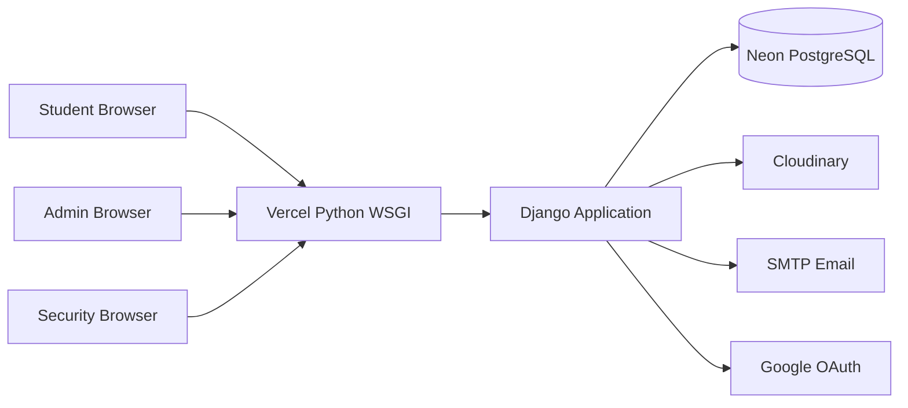

# Smart Campus Token Management System

## Presentation Details

| Field | Details |
|---|---|
| Course Name | B. Tech in Information Technology |
| Course Code | 123456 |
| Title | Smart Campus Token Management System |
| Project ID | `<ENTER PROJECT ID>` |
| Enrollment No. | `<ENTER ENROLLMENT NUMBER>` |
| Name | `<ENTER STUDENT NAME>` |
| Branch | Information Technology |
| Guide Name | `<ENTER GUIDE NAME>` |
| Presentation Date | 10-09-2025 |

> Replace the fields marked `<ENTER ...>` with the official university details before submission.

---

## Index

1. Introduction
2. Background and Motivation
3. Relevance and Importance
4. Literature Review
5. Objectives
6. Required Tools and Technology
7. Method / Approach
8. API Keys, AI/ML Models, and External Services
9. System Modules and Security
10. Expected Outcomes
11. Bibliography

---

# 1. Introduction

## Research Area

This project belongs to the areas of:

- Web-based campus automation
- Digital identity and access management
- Secure QR-code token systems
- Biometric evidence and identity verification
- Role-based authorization
- Cloud deployment and database-backed applications

## Project Introduction

Smart Campus Token Management System is a web application for managing campus entry digitally. It connects students, administrators, and security staff through a common platform.

The system allows:

- Students to register and verify their email address.
- Administrators to approve or reject student and staff accounts.
- Approved students to complete identity verification and generate time-bound campus entry tokens.
- Security staff to scan and validate QR tokens at the campus gate.
- Administrators to monitor users, branches, tokens, locations, and audit records.

The project replaces an informal paper-based or manually checked entry process with a controlled, traceable, and role-based digital workflow.

---

# 2. Background and Motivation

## Background

Traditional campus-entry processes often depend on identity cards, paper permissions, manual registers, or verbal confirmation. These methods can create problems such as:

- Long queues at entry points.
- Difficulty verifying whether a permission is still valid.
- Reuse of screenshots or old entry passes.
- Limited visibility for administrators.
- Missing or incomplete audit records.
- Difficulty managing different branches and user roles.

Cloud-based applications and secure QR codes provide a practical way to improve this process. A digital token can contain a signed identity and expiry payload that can be checked quickly at the gate.

## Motivation

The project is motivated by the need for:

- Faster and more reliable campus entry verification.
- Centralized management of students, administrators, and security staff.
- Better protection against forged or expired entry passes.
- Clear approval and rejection workflows.
- Evidence-based identity verification.
- A deployment model that can serve users through a public HTTPS URL.

The system is designed for a campus environment where access must be convenient for approved users and controllable by authorized staff.

---

# 3. Relevance and Importance

## Relevance

The system is relevant to:

- Universities and colleges
- Campus security departments
- Branch administrators
- Students and staff
- Institutions seeking paperless access workflows

## Importance

The project contributes the following practical improvements:

1. **Digital workflow:** Registration, verification, approval, token generation, and gate validation are handled in one application.
2. **Time-limited access:** Tokens expire after the selected duration.
3. **Single-use validation:** A token cannot be reused after successful gate validation.
4. **Role-based control:** Students, administrators, security staff, and super administrators have different permissions.
5. **Traceability:** Authentication, token, identity, and administrator actions can be recorded in audit logs.
6. **Cloud readiness:** The application is deployed through a Vercel Python WSGI function with PostgreSQL and Cloudinary support.
7. **Security-oriented design:** CSRF protection, secure cookies, HTTPS redirects, HSTS, rate limiting, password hashing, and signed tokens are included.

## New Insights and Contribution

The main contribution is an integrated campus-entry workflow that combines:

- Account approval and branch-level administration.
- Live webcam evidence capture.
- HMAC-signed QR tokens.
- Time and single-use validation rules.
- Cloud-hosted persistence and audit reporting.

The system is not presented as a replacement for institutional identity policy. It is a software platform that supports and records the institution's access decisions.

---

# 4. Literature Review

## Existing Developments

### 4.1 QR-Based Access Systems

QR codes are widely used for contactless access, event entry, and ticket verification. However, an unsigned QR code can be copied or modified. Therefore, this project signs the token payload using HMAC-SHA256 and verifies the signature before accepting the token.

### 4.2 Role-Based Access Control

Role-Based Access Control assigns permissions according to a user's role. This project applies role-based restrictions to students, branch administrators, security staff, and the main super administrator.

### 4.3 Digital Identity Verification

Modern identity workflows often use multiple signals such as email verification, account approval, PIN verification, and biometric evidence. This project uses email OTP verification and webcam capture as part of its identity-verification workflow. It does not claim to perform autonomous facial recognition.

### 4.4 Secure Web Applications

Secure web application practice requires protection against CSRF, brute-force attempts, insecure sessions, unauthorized object access, and unsafe file uploads. The project applies Django security middleware, secure cookie settings, rate limiting, input validation, and owner/role-scoped lookups.

### 4.5 Cloud Deployment

Cloud deployment allows the application to be accessed through HTTPS and connected to managed services. In this project, Vercel provides the Python WSGI runtime, Neon PostgreSQL stores application data, Cloudinary stores media, and SMTP delivers verification and notification emails.

## Current Research Gap / Problem

Many small campus-entry solutions handle only one feature, such as QR generation or attendance recording. They often do not combine:

- Account approval by organizational scope.
- Secure token signing.
- Identity evidence.
- Single-use validation.
- Auditability.
- Cloud deployment and operational health checks.

This project addresses the integration gap by combining these functions into one role-aware platform.

---

# 5. Objectives

## Primary Objective

To develop a secure, cloud-deployed campus-entry platform that manages user approval, identity verification, time-bound QR tokens, and security-gate validation.

## Specific Objectives

1. To create registration and email OTP verification workflows.
2. To implement role-based authentication for students, administrators, and security staff.
3. To allow branch administrators to approve, reject, and revoke student access.
4. To allow the super administrator to approve, reject, and revoke staff accounts.
5. To capture live webcam evidence for identity verification.
6. To generate QR tokens with expiry and signed payloads.
7. To prevent invalid, expired, revoked, and reused tokens from being accepted.
8. To provide a security-staff interface for QR validation.
9. To store audit, token, and identity-verification records in PostgreSQL.
10. To provide administrative reports and system-health monitoring.
11. To deploy the application through Vercel with production security settings.

---

# 6. Required Tools and Technology

## Software and Frameworks

| Area | Technology | Purpose |
|---|---|---|
| Programming language | Python | Application and backend development |
| Web framework | Django 5.1+ | Routing, forms, authentication, ORM, admin, security |
| API framework | Django REST Framework | Structured API support and throttling |
| Frontend | HTML, CSS, JavaScript, Bootstrap | User interfaces and browser interactions |
| Database | PostgreSQL | Production application data |
| Local database | SQLite | Local development and testing |
| Deployment | Vercel Python runtime | Public WSGI deployment |
| Static files | WhiteNoise / Django staticfiles | Static asset collection and serving |
| Media storage | Cloudinary | Persistent profile and identity media |
| Email | Gmail SMTP or compatible SMTP server | OTP and notification delivery |
| OAuth | Google OAuth 2.0 through django-allauth | Optional Google sign-in |
| Testing | Django TestCase | Automated application tests |
| Source control | Git and GitHub | Version control and deployment source |

## Python Packages Used

- `Django`
- `djangorestframework`
- `django-allauth`
- `django-ratelimit`
- `django-csp`
- `django-cors-headers`
- `django-cloudinary-storage`
- `cloudinary`
- `dj-database-url`
- `psycopg`
- `whitenoise`
- `argon2-cffi`
- `cryptography`
- `Pillow`
- `qrcode`
- `reportlab`
- `openpyxl`
- `bleach`

## Hardware / Browser Requirements

- Computer or mobile device with a modern browser.
- Webcam for live identity evidence capture.
- Internet connection for cloud deployment and hosted services.
- QR-capable device or camera for security validation.
- HTTPS-enabled deployment for camera access and secure cookies.

---

# 7. Method / Approach

## 7.1 System Architecture

## 7.2 Registration and Approval Workflow

1. A user submits the registration form.
2. Django validates role, branch, email, name, password, and student PIN rules.
3. The password is stored using a secure password hasher.
4. A six-digit OTP is generated and sent by SMTP.
5. The user verifies the OTP.
6. A branch administrator or super administrator reviews the account.
7. The account is approved, rejected, or later revoked according to role and organizational scope.

## 7.3 Identity Verification Workflow

1. The user opens the identity-verification page.
2. The browser requests webcam permission over HTTPS.
3. A live JPEG snapshot is captured.
4. The server validates the request type, size, capture mode, timestamp, and image format.
5. The verification evidence is stored as an audit record.
6. A short-lived verification state is placed in the user's session.

The project performs evidence capture and validation. It does not use a facial-recognition model or claim to identify a person automatically from facial features.

## 7.4 Token Generation Workflow

1. An approved and verified student selects a token duration.
2. The system checks the identity-verification state.
3. The token payload includes a token identifier, owner information, expiry, and relevant validation data.
4. The payload is signed with HMAC-SHA256 using the Django secret key.
5. A QR image and optional PDF pass are generated in memory.
6. The token record and token audit record are stored in PostgreSQL.

## 7.5 Gate Validation Workflow

1. Security staff scan or submit the QR token.
2. The server verifies the HMAC signature.
3. The server checks token existence, expiry, revocation, owner scope, and prior use.
4. A valid token is marked as used.
5. The result is returned as valid or invalid.
6. The validation event is included in audit records.

## 7.6 Administrative Reporting

Authorized administrators can review or download:

- Audit CSV reports
- Audit Excel reports
- Token CSV reports
- Token Excel reports
- JSON audit summaries

## 7.7 Deployment Approach

The application is deployed through Vercel using:

- `api/index.py` as the WSGI entry point.
- `vercel.json` for routing.
- `build_files.sh` for dependency installation, static collection, and migration execution.
- Vercel environment variables for production secrets and service configuration.
- Neon PostgreSQL for persistent relational data.
- Cloudinary for persistent media files.

---

# 8. API Keys, AI/ML Models, and External Services

## 8.1 API Keys Used

The project uses environment variables for service credentials. Secret values must never be placed in this presentation or source code.

| Credential / Variable | Service | Purpose |
|---|---|---|
| `DJANGO_SECRET_KEY` | Django | Session security and HMAC token signing input |
| `JWT_SECRET` | Application configuration | Separate signing secret reserved for JWT integrations |
| `DATABASE_URL` | Neon PostgreSQL | Database connection |
| `CLOUDINARY_URL` | Cloudinary | Media upload and storage authentication |
| `EMAIL_HOST_USER` | SMTP provider | Email sender account |
| `EMAIL_HOST_PASSWORD` | SMTP provider | SMTP authentication, preferably an app password |
| `GOOGLE_CLIENT_ID` | Google Cloud OAuth | Google sign-in client identifier |
| `GOOGLE_CLIENT_SECRET` | Google Cloud OAuth | Google sign-in client secret |

### Important Security Note

No real API keys, passwords, OAuth secrets, database URLs, or Cloudinary credentials should be shown in the presentation. They are configured privately in Vercel Environment Variables.

## 8.2 AI / ML Model Used

**No external AI or machine-learning model is used in the current implementation.**

The identity feature uses:

- Browser webcam access through `getUserMedia`.
- Live JPEG image capture.
- Server-side image and request validation.
- Short-lived identity-verification records.
- Optional security PIN verification.

The project does not use:

- OpenAI API
- Google Gemini API
- Microsoft Azure Face API
- AWS Rekognition
- TensorFlow model
- PyTorch model
- FaceNet model
- OpenCV face-recognition classifier

This distinction is important: the system captures and records live identity evidence, but it does not perform automated facial matching or classify a person's identity using an AI model.

## 8.3 Cryptographic Algorithm Used

The project uses **HMAC-SHA256** for signed QR token payloads.

- HMAC provides integrity and authenticity when the secret is protected.
- SHA-256 is used as the cryptographic hash function.
- A modified QR payload fails signature verification.
- The signing secret is read from the server environment and is never sent to the browser.

## 8.4 External Services and Their Roles

- **Vercel:** Hosts the Python WSGI application and routes public requests.
- **Neon PostgreSQL:** Stores users, branches, tokens, approvals, identity records, and audit logs.
- **Cloudinary:** Stores persistent media such as profile photos and approved identity evidence.
- **SMTP provider:** Sends email OTPs and account/token notifications.
- **Google OAuth:** Provides optional Google account sign-in.
- **Leaflet CDN:** Provides the map interface library for campus locations.

---

# 9. System Modules and Security

## Main Modules

1. **Accounts module:** Registration, login, logout, OTP verification, roles, and account approval.
2. **Biometrics module:** Webcam evidence capture, identity verification, and capture limits.
3. **Dashboard module:** Student, administrator, and security interfaces.
4. **Token module:** Token issuance, QR generation, expiry, revocation, and single-use validation.
5. **Core module:** Health checks, audit logging, reports, SEO, and security middleware.
6. **Campus location module:** Branch and campus location management.

## Security Controls

- CSRF tokens for form and AJAX POST requests.
- HTTPS redirect and secure cookies in production.
- HSTS and security response headers.
- Password hashing with Argon2 and PBKDF2 fallback.
- Rate limiting for login, registration, OTP, and sensitive operations.
- Server-side input validation and sanitization.
- Role-based and branch-scoped authorization.
- HMAC-SHA256 token signatures.
- Token expiry, revocation, and single-use checks.
- Request-size limits for identity evidence.
- Cloudinary and PostgreSQL credentials stored as environment variables.
- Immutable audit-log model behavior.

---

# 10. Expected Outcomes

The completed system is expected to:

- Reduce manual work at campus entry points.
- Provide faster QR-based gate verification.
- Prevent reuse of expired or already-used tokens.
- Give administrators clear approval and revocation controls.
- Maintain an auditable history of important security events.
- Support multiple user roles and campus branches.
- Provide secure cloud access through a Vercel HTTPS deployment.
- Establish a foundation for future AI-assisted identity verification if institutionally approved and ethically justified.

## Limitations

- The current implementation does not perform automated facial recognition.
- Email delivery depends on correct SMTP configuration and provider policy.
- Webcam capture requires browser permission and HTTPS.
- PostgreSQL and Cloudinary are required for production persistence.
- A token system supports access decisions but does not replace official university identity policy.

## Future Scope

- Optional approved facial-matching service with explicit consent and privacy controls.
- Mobile application for student and security workflows.
- Hardware QR scanners at entry gates.
- Analytics dashboard for entry patterns and peak hours.
- Multi-campus tenancy and central policy management.
- Push notifications for token expiry and approval decisions.
- Additional accessibility and multilingual support.

---

# 11. Bibliography

References are cited in the text using square brackets.

[1] Django Software Foundation, **Django Documentation**, available at: https://docs.djangoproject.com/

[2] Django Software Foundation, **Django Security**, available at: https://docs.djangoproject.com/en/stable/topics/security/

[3] OWASP Foundation, **OWASP Top 10 Web Application Security Risks**, available at: https://owasp.org/www-project-top-ten/

[4] OWASP Foundation, **Cross-Site Request Forgery Prevention Cheat Sheet**, available at: https://cheatsheetseries.owasp.org/cheatsheets/Cross-Site_Request_Forgery_Prevention_Cheat_Sheet.html

[5] IETF, **RFC 2104: HMAC: Keyed-Hashing for Message Authentication**, available at: https://www.rfc-editor.org/rfc/rfc2104

[6] NIST, **Secure Hash Standard, FIPS PUB 180-4**, available at: https://csrc.nist.gov/pubs/fips/180-4/upd1/final

[7] Vercel, **Python Runtime Documentation**, available at: https://vercel.com/docs/functions/runtimes/python

[8] PostgreSQL Global Development Group, **PostgreSQL Documentation**, available at: https://www.postgresql.org/docs/

[9] Cloudinary, **Cloudinary Documentation**, available at: https://cloudinary.com/documentation

[10] Google, **OAuth 2.0 Documentation**, available at: https://developers.google.com/identity/protocols/oauth2

[11] W3C, **Media Capture and Streams Specification**, available at: https://www.w3.org/TR/mediacapture-streams/

[12] Bootstrap, **Bootstrap Documentation**, available at: https://getbootstrap.com/docs/

---

# Suggested Presentation Closing

## Conclusion

Smart Campus Token Management System provides a secure and practical approach to digital campus entry management. It combines approval workflows, email verification, webcam evidence capture, signed QR tokens, single-use gate validation, audit logging, and cloud deployment through Vercel.

The current system is deliberately transparent about its capabilities: it uses secure web engineering and biometric evidence capture, but it does not claim to use an AI/ML facial-recognition model. This provides a clear foundation for future research while keeping the present implementation understandable, testable, and deployable.
